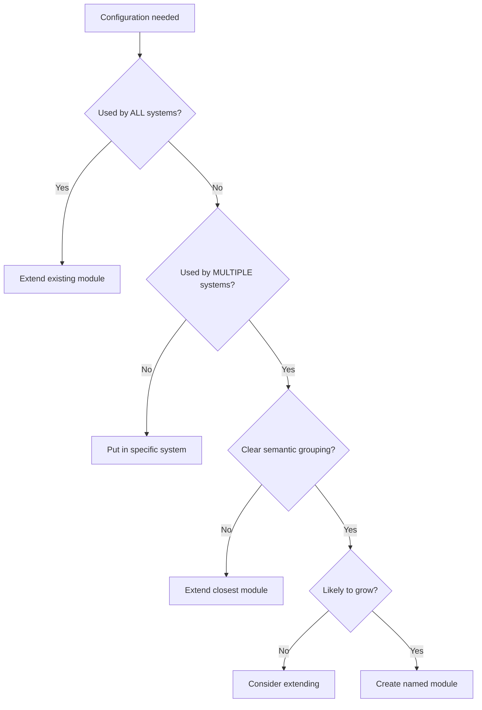
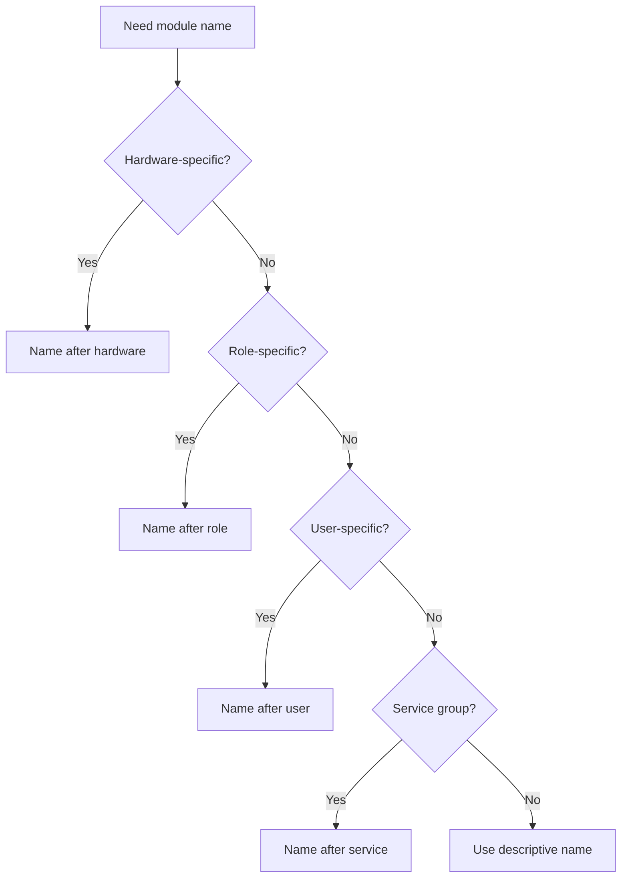

# Dendritic Pattern Quick Reference

## Command Reference (with pipe-operators)

### Essential Commands

**ALWAYS include `--extra-experimental-features pipe-operators` in every command!**

```bash
# Shorthand alias for convenience
alias nix='nix --extra-experimental-features pipe-operators'
```

### Flake Operations

```bash
# Show flake outputs
nix flake show --extra-experimental-features pipe-operators

# Update flake inputs
nix flake update --extra-experimental-features pipe-operators

# Lock specific input
nix flake lock --update-input nixpkgs --extra-experimental-features pipe-operators

# Check flake for errors
nix flake check --extra-experimental-features pipe-operators

# View flake metadata
nix flake metadata --extra-experimental-features pipe-operators
```

### Building and Testing

```bash
# Build system configuration
nix build .#nixosConfigurations.mysystem.config.system.build.toplevel \
  --extra-experimental-features pipe-operators

# Build and test in VM
nix build .#nixosConfigurations.mysystem.config.system.build.vm \
  --extra-experimental-features pipe-operators
./result/bin/run-*-vm

# Build specific check
nix build .#checks.x86_64-linux."configurations/nixos/mysystem" \
  --extra-experimental-features pipe-operators

# Run all checks
nix flake check --extra-experimental-features pipe-operators
```

### System Deployment

```bash
# Build and switch
sudo nixos-rebuild switch --flake .#mysystem \
  --extra-experimental-features pipe-operators

# Build only
sudo nixos-rebuild build --flake .#mysystem \
  --extra-experimental-features pipe-operators

# Test configuration
sudo nixos-rebuild test --flake .#mysystem \
  --extra-experimental-features pipe-operators

# Boot into configuration
sudo nixos-rebuild boot --flake .#mysystem \
  --extra-experimental-features pipe-operators
```

### Development

```bash
# Enter development shell
nix develop --extra-experimental-features pipe-operators

# Run formatter
nix fmt --extra-experimental-features pipe-operators

# Build package
nix build .#mypackage --extra-experimental-features pipe-operators

# Run package
nix run .#mypackage --extra-experimental-features pipe-operators
```

### Debugging

```bash
# Interactive evaluation
nix repl --extra-experimental-features pipe-operators
> :lf .  # Load flake
> config.flake.nixosModules.<TAB>  # Explore

# Show trace on error
nix build .#something --show-trace --extra-experimental-features pipe-operators

# Evaluate expression
nix eval .#nixosConfigurations.mysystem.config.networking.hostName \
  --extra-experimental-features pipe-operators

# Compare configurations
nix-diff path/to/result1 path/to/result2
```

## Module Decision Tree

### Should I Create a Named Module?



### Module Naming Decision



### Where to Put Configuration

| Configuration Type | Location            | Example                                |
| ------------------ | ------------------- | -------------------------------------- |
| System-specific    | `modules/[system]/` | `modules/laptop1/wifi.nix`             |
| Shared by some     | Named module        | `flake.nixosModules.laptop`            |
| Needed by all      | Extend base         | `flake.nixosModules.base.nix.settings` |
| User-specific      | `modules/users/`    | `modules/users/alice.nix`              |
| Service config     | `modules/services/` | `modules/services/nginx.nix`           |
| Hardware           | `modules/hardware/` | `modules/hardware/nvidia.nix`          |
| Development        | `modules/meta/`     | `modules/meta/fmt.nix`                 |

## Directory Structure Templates

### Minimal Structure

```
project/
├── flake.nix
├── flake.lock
└── modules/
    ├── configurations/
    │   └── nixos.nix
    ├── base.nix
    └── mysystem/
        ├── imports.nix
        ├── hardware.nix
        └── configuration.nix
```

### Standard Structure

```
project/
├── flake.nix
├── flake.lock
└── modules/
    ├── configurations/
    │   ├── nixos.nix
    │   └── home-manager.nix
    ├── meta/
    │   ├── fmt.nix
    │   └── devshell.nix
    ├── hardware/
    │   ├── efi.nix
    │   └── nvidia-gpu.nix
    ├── services/
    │   ├── nginx.nix
    │   └── postgresql.nix
    ├── users/
    │   └── alice.nix
    ├── base.nix
    ├── pc.nix
    ├── server.nix
    └── systems/
        ├── laptop/
        ├── desktop/
        └── webserver/
```

### Enterprise Structure

```
project/
├── flake.nix
├── flake.lock
├── README.md
├── docs/
│   └── architecture.md
└── modules/
    ├── configurations/
    │   ├── nixos.nix
    │   ├── home-manager.nix
    │   └── darwin.nix
    ├── meta/
    │   ├── ci.nix
    │   ├── fmt.nix
    │   ├── devshell.nix
    │   └── checks.nix
    ├── hardware/
    │   ├── profiles/
    │   └── drivers/
    ├── services/
    │   ├── web/
    │   ├── databases/
    │   ├── monitoring/
    │   └── backup/
    ├── security/
    │   ├── hardening.nix
    │   └── audit.nix
    ├── networking/
    │   ├── vpn/
    │   └── firewall/
    ├── users/
    │   ├── admins/
    │   └── developers/
    ├── environments/
    │   ├── production.nix
    │   ├── staging.nix
    │   └── development.nix
    ├── roles/
    │   ├── webserver.nix
    │   ├── database.nix
    │   └── loadbalancer.nix
    └── systems/
        ├── production/
        ├── staging/
        └── development/
```

## Common Patterns and Recipes

### Pattern: Base Module Extension

```nix
# modules/git/enable.nix
{
  flake.homeManagerModules.base.programs.git.enable = true;
}

# modules/git/config.nix
{ config, ... }:
{
  flake.homeManagerModules.base.programs.git = {
    userName = config.flake.meta.owner.name;
    userEmail = config.flake.meta.owner.email;
  };
}
```

### Pattern: Conditional Module Import

```nix
# modules/laptop/imports.nix
{ config, lib, ... }:
{
  configurations.nixos.laptop.module = {
    imports = with config.flake.nixosModules; [
      base
      pc
    ] ++ lib.optional (builtins.pathExists ./work.nix) work;
  };
}
```

### Pattern: Module Composition Hierarchy

```nix
# modules/pc.nix
{ config, ... }:
{
  flake.nixosModules.pc = {
    imports = [ config.flake.nixosModules.base ];
    # Desktop/laptop common config
  };
}

# modules/workstation.nix
{ config, ... }:
{
  flake.nixosModules.workstation = {
    imports = [ config.flake.nixosModules.pc ];
    # Development workstation config
  };
}
```

### Pattern: Polyglot Module (NixOS + Home-Manager)

```nix
# modules/neovim.nix
{ config, ... }:
{
  # System-level
  flake.nixosModules.base = { pkgs, ... }: {
    environment.systemPackages = [ pkgs.neovim ];
  };

  # User-level
  flake.homeManagerModules.base = {
    programs.neovim = {
      enable = true;
      vimAlias = true;
      viAlias = true;
    };
  };
}
```

### Pattern: Hardware Detection

```nix
# modules/hardware/gpu-auto.nix
{ lib, ... }:
{
  flake.nixosModules.base = { config, ... }: {
    services.xserver.videoDrivers = lib.mkDefault (
      if builtins.elem "nvidia" config.hardware.opengl.extraPackages
      then [ "nvidia" ]
      else [ "modesetting" ]
    );
  };
}
```

### Pattern: Service with Options

```nix
# modules/backup.nix
{ config, lib, ... }:
{
  options.flake.backup = {
    enable = lib.mkEnableOption "backup system";
    paths = lib.mkOption {
      type = lib.types.listOf lib.types.path;
      default = [ "/home" ];
    };
  };

  config = lib.mkIf config.flake.backup.enable {
    flake.nixosModules.base.services.restic.backups.main = {
      paths = config.flake.backup.paths;
      repository = "/backup";
      timerConfig.OnCalendar = "daily";
    };
  };
}
```

### Pattern: Package Override

```nix
# modules/packages/custom-vim.nix
{ ... }:
{
  perSystem = { pkgs, ... }: {
    packages.custom-vim = pkgs.vim_configurable.override {
      python3 = true;
      guiSupport = "gtk3";
    };
  };
}
```

### Pattern: Cross-System Package

```nix
# modules/packages/myapp.nix
{ self, ... }:
{
  perSystem = { pkgs, system, ... }: {
    packages.myapp = pkgs.stdenv.mkDerivation {
      pname = "myapp";
      version = "1.0.0";
      src = self;
      # ...
    };
  };

  # Make available to all systems
  flake.nixosModules.base = { pkgs, ... }: {
    environment.systemPackages = [
      self.packages.${pkgs.system}.myapp
    ];
  };
}
```

## Real-World Examples

### Example: Development Machine

```nix
# modules/development/tools.nix
{ ... }:
{
  flake.nixosModules.development = { pkgs, ... }: {
    virtualisation.docker.enable = true;

    environment.systemPackages = with pkgs; [
      # Version control
      git gh

      # Editors
      neovim vscode

      # Languages
      rustc cargo
      nodejs
      python3

      # Tools
      direnv
      just
      ripgrep
      fd
    ];
  };
}

# modules/systems/devbox/imports.nix
{ config, ... }:
{
  configurations.nixos.devbox.module = {
    imports = with config.flake.nixosModules; [
      base
      pc
      development
      docker
    ];
  };
}
```

### Example: Web Server

```nix
# modules/services/web-stack.nix
{ config, ... }:
{
  flake.nixosModules.web-stack = {
    services.nginx = {
      enable = true;
      recommendedProxySettings = true;
      recommendedTlsSettings = true;
    };

    services.postgresql.enable = true;
    services.redis.servers."".enable = true;

    networking.firewall.allowedTCPPorts = [ 80 443 ];
  };
}

# modules/sites/myapp.nix
{ config, ... }:
{
  flake.nixosModules.web-stack.services.nginx.virtualHosts."myapp.com" = {
    enableACME = true;
    forceSSL = true;
    locations."/" = {
      proxyPass = "http://localhost:3000";
    };
  };
}
```

### Example: Multi-User System

```nix
# modules/users/base-users.nix
{ config, lib, ... }:
let
  users = {
    alice = {
      uid = 1000;
      groups = [ "wheel" "docker" ];
      shell = "zsh";
    };
    bob = {
      uid = 1001;
      groups = [ "users" ];
      shell = "bash";
    };
  };
in
{
  flake.nixosModules.base = { pkgs, ... }: {
    users.users = lib.mapAttrs (name: cfg: {
      isNormalUser = true;
      uid = cfg.uid;
      extraGroups = cfg.groups;
      shell = pkgs.${cfg.shell};
    }) users;
  };
}
```

## Debugging Techniques

### Exploring Configuration

```nix
# In nix repl
nix repl --extra-experimental-features pipe-operators
> :lf .
> :p config.flake.nixosModules  # Print all NixOS modules
> :p config.configurations.nixos  # Print all configurations
> :p config.flake.nixosConfigurations.mysystem.config.boot  # Explore specific config
```

### Finding Issues

```bash
# Check for evaluation errors with trace
nix flake check --show-trace --extra-experimental-features pipe-operators

# See what changed
nix diff-closures /run/current-system ./result

# Check module imports
nix eval .#nixosConfigurations.mysystem.config.system.modules \
  --extra-experimental-features pipe-operators

# List all options
nix eval .#nixosConfigurations.mysystem.options \
  --apply 'builtins.attrNames' \
  --extra-experimental-features pipe-operators
```

### Common Debug Patterns

```nix
# Add debug output to modules
{ lib, ... }:
{
  flake.nixosModules.base = lib.traceSeq "Loading base module" {
    # config...
  };
}

# Conditional debugging
{ lib, config, ... }:
{
  flake.nixosModules.base =
    lib.optionalAttrs (config.debug or false)
      (lib.traceSeq "Debug mode enabled" {});
}
```

## FAQ

### Q: Why do I need pipe-operators for everything?

**A:** The dendritic pattern extensively uses pipe operators (`|>`) for elegant function composition. This is an experimental feature that must be explicitly enabled. Example usage:

```nix
# Without pipe operators (traditional)
lib.mkMerge (lib.mapAttrsToList (name: value: { ${name} = value; }) attrs)

# With pipe operators (dendritic)
attrs
|> lib.mapAttrsToList (name: value: { ${name} = value; })
|> lib.mkMerge
```

### Q: Can I mix dendritic with traditional imports?

**A:** Technically yes, but it defeats the purpose. The power comes from complete adoption:

```nix
# Avoid this
imports = [
  ./some-file.nix  # Bad: literal import
  config.flake.nixosModules.base  # Good: named reference
];
```

### Q: How do I share modules between projects?

**A:** Several approaches:

1. **Git submodules:**

```bash
git submodule add https://github.com/user/shared-modules modules/shared
```

2. **Flake input:**

```nix
inputs.shared-modules.url = "github:user/shared-modules";
# Then import in flake
imports = [
  (inputs.import-tree ./modules)
  inputs.shared-modules.modules
];
```

3. **Copy and customize:**
   Often the simplest - copy modules and adapt to your needs.

### Q: What about secrets management?

**A:** The dendritic pattern works with any secrets solution:

```nix
# With agenix
{ config, ... }:
{
  flake.nixosModules.base = {
    age.secrets.password.file = "${config.flake.root}/secrets/password.age";
  };
}

# With sops-nix
{ config, ... }:
{
  flake.nixosModules.base = {
    sops.defaultSopsFile = "${config.flake.root}/secrets/secrets.yaml";
  };
}
```

### Q: How do I handle different architectures?

**A:** Use system-specific modules:

```nix
# modules/architectures/x86_64.nix
{ ... }:
{
  flake.nixosModules.x86_64 = {
    nixpkgs.hostPlatform = "x86_64-linux";
    boot.kernelPackages = pkgs.linuxPackages_latest;
  };
}

# modules/architectures/aarch64.nix
{ ... }:
{
  flake.nixosModules.aarch64 = {
    nixpkgs.hostPlatform = "aarch64-linux";
    boot.kernelPackages = pkgs.linuxPackages_rpi4;
  };
}
```

### Q: Can I use this with Darwin (macOS)?

**A:** Yes! Add nix-darwin support:

```nix
# modules/configurations/darwin.nix
{ lib, config, ... }:
{
  options.configurations.darwin = lib.mkOption {
    type = lib.types.lazyAttrsOf (
      lib.types.submodule {
        options.module = lib.mkOption {
          type = lib.types.deferredModule;
        };
      }
    );
  };

  config.flake.darwinConfigurations =
    lib.flip lib.mapAttrs config.configurations.darwin (
      name: { module }:
        inputs.darwin.lib.darwinSystem {
          modules = [ module ];
        }
    );
}
```

### Q: How do I test changes without affecting my system?

**A:** Multiple approaches:

1. **VM testing:**

```bash
nix build .#nixosConfigurations.mysystem.config.system.build.vm \
  --extra-experimental-features pipe-operators
./result/bin/run-*-vm
```

2. **Container testing:**

```nix
# Create a container configuration
configurations.nixos.test-container.module = {
  imports = [ config.flake.nixosModules.base ];
  boot.isContainer = true;
};
```

3. **Separate profile:**

```bash
sudo nixos-rebuild build --flake .#test-system \
  --extra-experimental-features pipe-operators
# Don't switch, just test the build
```

### Q: What's the performance impact?

**A:** Minimal to positive:

- **Evaluation:** Similar to traditional (lazy evaluation helps)
- **Build time:** Unchanged (same derivations)
- **Maintenance time:** Significantly reduced
- **Refactoring time:** Near zero

### Q: How do I migrate gradually?

**A:** Start with hybrid approach:

```nix
# Phase 1: Wrapper module
# modules/legacy.nix
{ ... }:
{
  flake.nixosModules.legacy = {
    imports = [ ../../old-config/configuration.nix ];
  };
}

# Phase 2: Extract piece by piece
# Move services, users, packages gradually

# Phase 3: Remove legacy wrapper
```

Remember: The dendritic pattern is a journey, not a destination. Your configuration will continue evolving as you discover better organizations!
