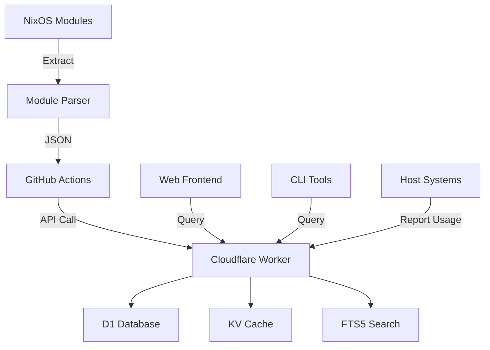

# NixOS Module Documentation API - Implementation Plan

## Executive Summary

This document outlines the implementation of a Cloudflare Workers-based documentation system for NixOS modules. The system will automatically extract, store, search, and serve module documentation while tracking usage across hosts.

## Table of Contents

1. [Architecture Overview](#architecture-overview)
2. [Phase 1: Infrastructure Setup](#phase-1-infrastructure-setup)
3. [Phase 2: Module Extraction](#phase-2-module-extraction)
4. [Phase 3: Worker API Development](#phase-3-worker-api-development)
5. [Phase 4: Database Schema & Search](#phase-4-database-schema--search)
6. [Phase 5: CI/CD Integration](#phase-5-cicd-integration)
7. [Phase 6: Frontend Development](#phase-6-frontend-development)
8. [Phase 7: Monitoring & Observability](#phase-7-monitoring--observability)
9. [Phase 8: Testing & Validation](#phase-8-testing--validation)
10. [Phase 9: Deployment & Migration](#phase-9-deployment--migration)
11. [Phase 10: Documentation & Maintenance](#phase-10-documentation--maintenance)

---

## Architecture Overview

### Components



### Technology Stack

- **Extraction**: Nix evaluation with custom parser
- **API**: Cloudflare Workers (TypeScript, Hono framework)
- **Database**: D1 (SQLite) with FTS5 for search
- **Cache**: Workers KV for frequently accessed modules
- **Frontend**: Static HTML/JS with Workers Static Assets
- **CI/CD**: GitHub Actions with secrets management
- **Monitoring**: Workers Analytics Engine

---

## Phase 1: Infrastructure Setup

### Objectives

- Create Cloudflare account resources
- Set up development environment
- Initialize project structure

### Tasks

#### 1.1 Cloudflare Resources

```bash
# Create D1 database
npx wrangler d1 create nixos-modules-db

# Create KV namespace
npx wrangler kv:namespace create MODULE_CACHE
npx wrangler kv:namespace create MODULE_CACHE --preview  # For development

# Create Analytics Engine dataset (optional)
npx wrangler analytics-engine create MODULE_ANALYTICS
```

#### 1.2 Project Structure

```
cloudflare-module-docs/
├── src/
│   ├── index.ts          # Main Worker entry
│   ├── db/
│   │   ├── schema.ts     # Database schema
│   │   └── migrations/   # D1 migrations
│   ├── handlers/
│   │   ├── modules.ts    # Module endpoints
│   │   ├── search.ts     # Search functionality
│   │   └── hosts.ts      # Host tracking
│   ├── lib/
│   │   ├── auth.ts       # Authentication
│   │   ├── cache.ts      # KV caching logic
│   │   └── parser.ts     # Module data parsing
│   └── types.ts          # TypeScript definitions
├── public/               # Frontend assets
├── scripts/             # Nix extraction scripts
├── tests/              # Test suites
├── wrangler.jsonc      # Worker configuration
└── package.json
```

#### 1.3 Dependencies

```json
{
  "dependencies": {
    "hono": "^3.12.0",
    "zod": "^3.22.0"
  },
  "devDependencies": {
    "@cloudflare/workers-types": "^4.0.0",
    "wrangler": "^3.0.0",
    "vitest": "^1.0.0",
    "miniflare": "^3.0.0"
  }
}
```

### Success Criteria

- [ ] D1 database created and accessible
- [ ] KV namespaces configured
- [ ] Project structure initialized
- [ ] Development environment functional

---

## Phase 2: Module Extraction

### Objectives

- Parse NixOS modules from the dendritic pattern
- Extract comprehensive metadata
- Generate JSON for API consumption

### Implementation

#### 2.1 Module Parser (Nix)

```nix
# scripts/extract-modules.nix
{ config, lib, pkgs, ... }:
let
  # Extract option information
  extractOption = name: opt: {
    inherit name;
    type = lib.optionalString (opt ? type) (builtins.typeOf opt.type);
    default = opt.default or null;
    description = opt.description or null;
    example = opt.example or null;
    readOnly = opt.readOnly or false;
    internal = opt.internal or false;
  };

  # Process a single module
  processModule = path: module: {
    path = path;
    name = lib.last (lib.splitString "/" path);
    namespace = lib.head (lib.splitString "/" (lib.removePrefix "modules/" path));
    description = module.meta.description or null;
    maintainers = module.meta.maintainers or [];

    # Extract options if module has them
    options = lib.optionalAttrs (module ? options)
      (lib.mapAttrsToList extractOption module.options);

    # Track imports for dependency graph
    imports = map toString (module.imports or []);

    # Include examples if provided
    examples = module.meta.examples or [];

    # Check if module is conditional
    conditional = module.meta.conditional or false;
  };

  # Collect all modules from flake
  allModules = lib.mapAttrsToList processModule {
    nixos = config.flake.nixosModules;
    homeManager = config.flake.homeManagerModules;
  };
in {
  # Export as JSON
  moduleData = pkgs.writeText "modules.json" (builtins.toJSON allModules);

  # Create upload script
  uploadScript = pkgs.writeShellScriptBin "upload-module-docs" ''
    #!/usr/bin/env bash
    set -euo pipefail

    API_URL="''${MODULE_DOCS_URL:-https://nixos-modules.workers.dev}"
    API_KEY="''${MODULE_DOCS_API_KEY}"

    if [ -z "$API_KEY" ]; then
      echo "Error: MODULE_DOCS_API_KEY not set"
      exit 1
    fi

    echo "Uploading module documentation..."
    curl -X POST "$API_URL/api/modules/batch" \
      -H "X-API-Key: $API_KEY" \
      -H "Content-Type: application/json" \
      -d @${moduleData} \
      --fail-with-body
  '';
}
```

#### 2.2 Host Usage Tracker

```nix
# modules/telemetry/module-tracker.nix
{ config, lib, pkgs, ... }:
{
  options.documentation.reportUsage = lib.mkEnableOption "Report module usage to documentation API";

  config = lib.mkIf config.documentation.reportUsage {
    systemd.services.report-module-usage = {
      description = "Report module usage to documentation API";
      after = [ "network-online.target" ];
      wants = [ "network-online.target" ];

      serviceConfig = {
        Type = "oneshot";
        ExecStart = pkgs.writeShellScript "report-usage" ''
          HOSTNAME=$(hostname)
          MODULES=$(nix eval --json .#nixosConfigurations.$HOSTNAME.config.environment.systemPackages)

          curl -X POST "$MODULE_DOCS_URL/api/hosts/$HOSTNAME/modules" \
            -H "X-API-Key: $MODULE_DOCS_API_KEY" \
            -H "Content-Type: application/json" \
            -d "{\"modules\": $MODULES}" \
            || true  # Don't fail if API is down
        '';
      };

      # Run on boot and daily
      startAt = [ "*-*-* 00:00:00" ];
    };
  };
}
```

### Success Criteria

- [ ] Module parser extracts all metadata
- [ ] Handles dendritic pattern correctly
- [ ] Generates valid JSON output
- [ ] Host usage tracking implemented

---

## Phase 3: Worker API Development

### Objectives

- Implement RESTful API endpoints
- Handle authentication and authorization
- Optimize for edge performance

### API Endpoints

#### 3.1 Public Endpoints (No Auth)

| Method | Path                                         | Description          |
| ------ | -------------------------------------------- | -------------------- |
| GET    | `/`                                          | API documentation    |
| GET    | `/api/modules`                               | List all modules     |
| GET    | `/api/modules/search`                        | Full-text search     |
| GET    | `/api/modules/:namespace/:name`              | Get module details   |
| GET    | `/api/modules/:namespace/:name/usage`        | Get usage statistics |
| GET    | `/api/modules/:namespace/:name/dependencies` | Get dependency graph |
| GET    | `/api/hosts`                                 | List all known hosts |
| GET    | `/api/stats`                                 | Global statistics    |

#### 3.2 Protected Endpoints (API Key Required)

| Method | Path                            | Description          |
| ------ | ------------------------------- | -------------------- |
| POST   | `/api/modules/batch`            | Batch update modules |
| POST   | `/api/hosts/:hostname/modules`  | Update host usage    |
| DELETE | `/api/modules/:namespace/:name` | Remove module        |
| POST   | `/api/cache/purge`              | Purge cache          |

#### 3.3 Implementation Example

```typescript
// src/handlers/modules.ts
import { Hono } from "hono";
import { z } from "zod";

const ModuleSchema = z.object({
  path: z.string(),
  name: z.string(),
  namespace: z.string(),
  description: z.string().optional(),
  options: z.array(
    z.object({
      name: z.string(),
      type: z.string(),
      default: z.any().optional(),
      description: z.string().optional(),
    }),
  ),
  imports: z.array(z.string()),
  examples: z.array(z.string()).optional(),
});

export const createModuleHandlers = (app: Hono<{ Bindings: Env }>) => {
  // List modules with pagination
  app.get("/api/modules", async (c) => {
    const { namespace, limit = 50, offset = 0 } = c.req.query();

    // Build query with optional namespace filter
    let query = c.env.MODULES_DB.prepare(`
      SELECT m.*, COUNT(DISTINCT hu.hostname) as usage_count
      FROM modules m
      LEFT JOIN host_usage hu ON m.path = hu.module_path
      ${namespace ? "WHERE m.namespace = ?" : ""}
      GROUP BY m.id
      ORDER BY usage_count DESC, m.namespace, m.name
      LIMIT ? OFFSET ?
    `);

    const params = namespace ? [namespace, limit, offset] : [limit, offset];

    const results = await query.bind(...params).all();

    return c.json({
      modules: results.results,
      pagination: {
        total: results.meta.row_count,
        limit,
        offset,
      },
    });
  });

  // Full-text search
  app.get("/api/modules/search", async (c) => {
    const q = c.req.query("q");
    if (!q) {
      return c.json({ error: "Query required" }, 400);
    }

    // Check cache first
    const cacheKey = `search:${q}`;
    const cached = await c.env.MODULE_CACHE.get(cacheKey, "json");
    if (cached) {
      return c.json(cached);
    }

    // Perform FTS5 search
    const results = await c.env.MODULES_DB.prepare(
      `
      SELECT m.*, snippet(modules_fts, 2, '<mark>', '</mark>', '...', 32) as snippet
      FROM modules m
      JOIN modules_fts ON m.id = modules_fts.rowid
      WHERE modules_fts MATCH ?
      ORDER BY rank
      LIMIT 20
    `,
    )
      .bind(q)
      .all();

    const response = {
      query: q,
      results: results.results,
      count: results.results.length,
    };

    // Cache for 5 minutes
    await c.env.MODULE_CACHE.put(cacheKey, JSON.stringify(response), {
      expirationTtl: 300,
    });

    return c.json(response);
  });
};
```

### Success Criteria

- [ ] All endpoints implemented and tested
- [ ] Authentication working correctly
- [ ] Rate limiting in place
- [ ] Response times < 50ms for cached requests

---

## Phase 4: Database Schema & Search

### Objectives

- Design efficient database schema
- Implement full-text search
- Optimize query performance

### Database Schema

#### 4.1 Core Tables

```sql
-- modules table
CREATE TABLE modules (
  id INTEGER PRIMARY KEY AUTOINCREMENT,
  path TEXT UNIQUE NOT NULL,
  name TEXT NOT NULL,
  namespace TEXT NOT NULL,
  description TEXT,
  examples TEXT,  -- JSON array
  metadata TEXT,  -- JSON object for extra fields
  created_at DATETIME DEFAULT CURRENT_TIMESTAMP,
  updated_at DATETIME DEFAULT CURRENT_TIMESTAMP,
  INDEX idx_namespace (namespace),
  INDEX idx_name (name),
  UNIQUE(namespace, name)
);

-- module_options table
CREATE TABLE module_options (
  id INTEGER PRIMARY KEY AUTOINCREMENT,
  module_id INTEGER NOT NULL,
  name TEXT NOT NULL,
  type TEXT NOT NULL,
  default_value TEXT,  -- JSON
  description TEXT,
  example TEXT,  -- JSON
  read_only BOOLEAN DEFAULT FALSE,
  internal BOOLEAN DEFAULT FALSE,
  FOREIGN KEY (module_id) REFERENCES modules(id) ON DELETE CASCADE,
  INDEX idx_module_id (module_id)
);

-- module_dependencies table
CREATE TABLE module_dependencies (
  id INTEGER PRIMARY KEY AUTOINCREMENT,
  module_id INTEGER NOT NULL,
  depends_on_path TEXT NOT NULL,
  dependency_type TEXT DEFAULT 'imports',
  FOREIGN KEY (module_id) REFERENCES modules(id) ON DELETE CASCADE,
  INDEX idx_module_id (module_id),
  INDEX idx_depends_on (depends_on_path)
);

-- host_usage table
CREATE TABLE host_usage (
  id INTEGER PRIMARY KEY AUTOINCREMENT,
  hostname TEXT NOT NULL,
  module_path TEXT NOT NULL,
  first_seen DATETIME DEFAULT CURRENT_TIMESTAMP,
  last_seen DATETIME DEFAULT CURRENT_TIMESTAMP,
  UNIQUE(hostname, module_path),
  INDEX idx_hostname (hostname),
  INDEX idx_module_path (module_path)
);

-- module_versions table (for tracking changes)
CREATE TABLE module_versions (
  id INTEGER PRIMARY KEY AUTOINCREMENT,
  module_id INTEGER NOT NULL,
  version_hash TEXT NOT NULL,
  changes TEXT,  -- JSON diff
  created_at DATETIME DEFAULT CURRENT_TIMESTAMP,
  FOREIGN KEY (module_id) REFERENCES modules(id) ON DELETE CASCADE,
  INDEX idx_module_id (module_id),
  INDEX idx_created_at (created_at)
);
```

#### 4.2 Full-Text Search Setup

```sql
-- Create FTS5 virtual table
CREATE VIRTUAL TABLE modules_fts USING fts5(
  name,
  namespace,
  description,
  option_names,
  option_descriptions,
  content=modules,
  tokenize='porter unicode61'
);

-- Triggers to keep FTS in sync
CREATE TRIGGER modules_ai AFTER INSERT ON modules BEGIN
  INSERT INTO modules_fts(rowid, name, namespace, description)
  VALUES (new.id, new.name, new.namespace, new.description);
END;

CREATE TRIGGER modules_ad AFTER DELETE ON modules BEGIN
  DELETE FROM modules_fts WHERE rowid = old.id;
END;

CREATE TRIGGER modules_au AFTER UPDATE ON modules BEGIN
  UPDATE modules_fts
  SET name = new.name,
      namespace = new.namespace,
      description = new.description
  WHERE rowid = new.id;
END;
```

#### 4.3 Migration System

```typescript
// src/db/migrations/001_initial.ts
export const migration_001 = {
  version: 1,
  up: async (db: D1Database) => {
    await db.batch([
      db.prepare(/* CREATE TABLE modules ... */),
      db.prepare(/* CREATE TABLE module_options ... */),
      db.prepare(/* CREATE TABLE module_dependencies ... */),
      db.prepare(/* CREATE TABLE host_usage ... */),
      db.prepare(/* CREATE VIRTUAL TABLE modules_fts ... */),
    ]);
  },
  down: async (db: D1Database) => {
    await db.batch([
      db.prepare("DROP TABLE IF EXISTS modules_fts"),
      db.prepare("DROP TABLE IF EXISTS host_usage"),
      db.prepare("DROP TABLE IF EXISTS module_dependencies"),
      db.prepare("DROP TABLE IF EXISTS module_options"),
      db.prepare("DROP TABLE IF EXISTS modules"),
    ]);
  },
};
```

### Success Criteria

- [ ] Schema supports all required queries
- [ ] FTS5 search returns relevant results
- [ ] Indexes optimize common queries
- [ ] Migration system functional

---

## Phase 5: CI/CD Integration

### Objectives

- Automate module extraction on changes
- Deploy Worker updates safely
- Implement rollback capabilities

### GitHub Actions Workflow

#### 5.1 Module Documentation Update

```yaml
# .github/workflows/update-module-docs.yml
name: Update Module Documentation

on:
  push:
    branches: [main]
    paths:
      - "modules/**"
      - "flake.nix"
      - "flake.lock"
  pull_request:
    types: [opened, synchronize]
    paths:
      - "modules/**"
  workflow_dispatch:
    inputs:
      force_update:
        description: "Force update all modules"
        type: boolean
        default: false

jobs:
  extract-modules:
    runs-on: ubuntu-latest
    steps:
      - uses: actions/checkout@v4

      - uses: cachix/install-nix-action@v27
        with:
          nix_path: nixpkgs=channel:nixos-unstable
          extra_nix_config: |
            experimental-features = nix-command flakes

      - name: Extract module documentation
        run: |
          nix develop -c extract-module-docs > modules.json

      - name: Validate JSON
        run: |
          jq empty modules.json
          echo "Module count: $(jq '. | length' modules.json)"

      - name: Upload to API (PR preview)
        if: github.event_name == 'pull_request'
        env:
          MODULE_DOCS_URL: ${{ secrets.MODULE_DOCS_PREVIEW_URL }}
          MODULE_DOCS_API_KEY: ${{ secrets.MODULE_DOCS_API_KEY }}
        run: |
          curl -X POST "$MODULE_DOCS_URL/api/modules/preview" \
            -H "X-API-Key: $MODULE_DOCS_API_KEY" \
            -H "X-PR-Number: ${{ github.event.pull_request.number }}" \
            -d @modules.json

      - name: Upload to API (Production)
        if: github.ref == 'refs/heads/main'
        env:
          MODULE_DOCS_URL: ${{ secrets.MODULE_DOCS_URL }}
          MODULE_DOCS_API_KEY: ${{ secrets.MODULE_DOCS_API_KEY }}
        run: |
          curl -X POST "$MODULE_DOCS_URL/api/modules/batch" \
            -H "X-API-Key: $MODULE_DOCS_API_KEY" \
            -d @modules.json

      - name: Notify on failure
        if: failure()
        uses: actions/github-script@v7
        with:
          script: |
            github.rest.issues.createComment({
              issue_number: context.issue.number,
              owner: context.repo.owner,
              repo: context.repo.repo,
              body: '❌ Module documentation update failed. Check the logs.'
            })
```

#### 5.2 Worker Deployment

```yaml
# .github/workflows/deploy-worker.yml
name: Deploy Documentation Worker

on:
  push:
    branches: [main]
    paths:
      - "cloudflare-module-docs/**"
  workflow_dispatch:

jobs:
  deploy:
    runs-on: ubuntu-latest
    defaults:
      run:
        working-directory: cloudflare-module-docs

    steps:
      - uses: actions/checkout@v4

      - uses: actions/setup-node@v4
        with:
          node-version: "20"
          cache: "npm"
          cache-dependency-path: cloudflare-module-docs/package-lock.json

      - name: Install dependencies
        run: npm ci

      - name: Run tests
        run: npm test

      - name: Deploy to Cloudflare
        uses: cloudflare/wrangler-action@v3
        with:
          apiToken: ${{ secrets.CLOUDFLARE_API_TOKEN }}
          workingDirectory: cloudflare-module-docs
          command: deploy --env production

      - name: Run smoke tests
        run: |
          sleep 10  # Wait for deployment
          curl -f https://nixos-modules.workers.dev/api/stats

      - name: Create deployment record
        run: |
          echo "Deployed at $(date -u +%Y-%m-%dT%H:%M:%SZ)" >> deployments.log
          git add deployments.log
          git commit -m "chore: record deployment"
          git push
```

### Success Criteria

- [ ] Automatic extraction on module changes
- [ ] Preview deployments for PRs
- [ ] Production deployments on merge
- [ ] Rollback capability implemented

---

## Phase 6: Frontend Development

### Objectives

- Create user-friendly search interface
- Visualize module dependencies
- Display usage statistics

### Frontend Architecture

#### 6.1 Technology Choices

- **Framework**: Vanilla JS with Web Components (for simplicity)
- **Styling**: Tailwind CSS via CDN
- **Search**: Real-time with debouncing
- **Visualization**: D3.js for dependency graphs
- **Hosting**: Workers Static Assets

#### 6.2 Core Features

```html
<!-- public/index.html -->
<!DOCTYPE html>
<html lang="en">
  <head>
    <meta charset="UTF-8" />
    <meta name="viewport" content="width=device-width, initial-scale=1.0" />
    <title>NixOS Module Explorer</title>
    <script src="https://cdn.tailwindcss.com"></script>
    <link
      rel="stylesheet"
      href="https://cdnjs.cloudflare.com/ajax/libs/prism/1.29.0/themes/prism-tomorrow.min.css"
    />
  </head>
  <body class="bg-gray-50">
    <!-- Search Component -->
    <module-search></module-search>

    <!-- Results Component -->
    <module-results></module-results>

    <!-- Detail View Component -->
    <module-detail></module-detail>

    <script type="module" src="/js/app.js"></script>
  </body>
</html>
```

#### 6.3 Web Components

```javascript
// public/js/components/module-search.js
class ModuleSearch extends HTMLElement {
  constructor() {
    super();
    this.attachShadow({ mode: "open" });
    this.debounceTimer = null;
  }

  connectedCallback() {
    this.shadowRoot.innerHTML = `
      <style>
        :host {
          display: block;
          padding: 1rem;
        }
        input {
          width: 100%;
          padding: 0.75rem 1rem;
          font-size: 1.125rem;
          border: 2px solid #e5e7eb;
          border-radius: 0.5rem;
          transition: all 0.2s;
        }
        input:focus {
          outline: none;
          border-color: #3b82f6;
          box-shadow: 0 0 0 3px rgba(59, 130, 246, 0.1);
        }
      </style>
      <input
        type="search"
        placeholder="Search modules (e.g., 'workstation', 'security', 'git')"
        aria-label="Search modules"
      >
    `;

    const input = this.shadowRoot.querySelector("input");
    input.addEventListener("input", (e) => this.handleSearch(e.target.value));
  }

  handleSearch(query) {
    clearTimeout(this.debounceTimer);
    this.debounceTimer = setTimeout(async () => {
      if (query.trim()) {
        const results = await this.searchModules(query);
        this.dispatchEvent(
          new CustomEvent("search", {
            detail: { query, results },
            bubbles: true,
            composed: true,
          }),
        );
      } else {
        this.dispatchEvent(
          new CustomEvent("clear", {
            bubbles: true,
            composed: true,
          }),
        );
      }
    }, 300);
  }

  async searchModules(query) {
    const response = await fetch(
      `/api/modules/search?q=${encodeURIComponent(query)}`,
    );
    return response.json();
  }
}

customElements.define("module-search", ModuleSearch);
```

### Success Criteria

- [ ] Responsive design works on mobile
- [ ] Search returns results in < 200ms
- [ ] Dependency graph visualization works
- [ ] Accessible (ARIA labels, keyboard nav)

---

## Phase 7: Monitoring & Observability

### Objectives

- Track API performance and usage
- Monitor search effectiveness
- Alert on issues

### Implementation

#### 7.1 Analytics Engine Integration

```typescript
// src/lib/analytics.ts
interface AnalyticsEvent {
  endpoint: string;
  method: string;
  status: number;
  duration: number;
  searchQuery?: string;
  resultsCount?: number;
  cacheHit?: boolean;
}

export class Analytics {
  constructor(private dataset: AnalyticsEngineDataset) {}

  trackRequest(event: AnalyticsEvent) {
    this.dataset.writeDataPoint({
      indexes: [event.endpoint],
      blobs: [event.method, event.searchQuery].filter(Boolean),
      doubles: [event.status, event.duration, event.resultsCount ?? -1],
    });
  }

  trackSearch(query: string, resultsCount: number, duration: number) {
    this.dataset.writeDataPoint({
      indexes: ["search"],
      blobs: [query.toLowerCase()],
      doubles: [resultsCount, duration],
    });
  }

  trackCacheHit(key: string, hit: boolean) {
    this.dataset.writeDataPoint({
      indexes: ["cache"],
      blobs: [key],
      doubles: [hit ? 1 : 0],
    });
  }
}
```

#### 7.2 Health Checks

```typescript
// src/handlers/health.ts
app.get("/health", async (c) => {
  const checks = {
    database: false,
    cache: false,
    search: false,
  };

  // Check database
  try {
    const result = await c.env.MODULES_DB.prepare("SELECT 1").first();
    checks.database = !!result;
  } catch (e) {
    console.error("Database check failed:", e);
  }

  // Check cache
  try {
    await c.env.MODULE_CACHE.put("health-check", "ok", { expirationTtl: 60 });
    const value = await c.env.MODULE_CACHE.get("health-check");
    checks.cache = value === "ok";
  } catch (e) {
    console.error("Cache check failed:", e);
  }

  // Check search
  try {
    const result = await c.env.MODULES_DB.prepare(
      "SELECT 1 FROM modules_fts LIMIT 1",
    ).first();
    checks.search = true;
  } catch (e) {
    console.error("Search check failed:", e);
  }

  const allHealthy = Object.values(checks).every((v) => v);

  return c.json(
    {
      status: allHealthy ? "healthy" : "degraded",
      checks,
      timestamp: new Date().toISOString(),
    },
    allHealthy ? 200 : 503,
  );
});
```

#### 7.3 Alerting

```yaml
# .github/workflows/health-monitor.yml
name: Health Monitor

on:
  schedule:
    - cron: "*/5 * * * *" # Every 5 minutes
  workflow_dispatch:

jobs:
  check:
    runs-on: ubuntu-latest
    steps:
      - name: Check API health
        id: health
        run: |
          response=$(curl -s -w "\n%{http_code}" https://nixos-modules.workers.dev/health)
          http_code=$(echo "$response" | tail -n 1)
          body=$(echo "$response" | head -n -1)

          echo "status=$http_code" >> $GITHUB_OUTPUT
          echo "body=$body" >> $GITHUB_OUTPUT

          if [ "$http_code" != "200" ]; then
            echo "Health check failed with status $http_code"
            exit 1
          fi

      - name: Send Discord notification on failure
        if: failure()
        env:
          DISCORD_WEBHOOK: ${{ secrets.DISCORD_WEBHOOK }}
        run: |
          curl -X POST "$DISCORD_WEBHOOK" \
            -H "Content-Type: application/json" \
            -d "{\"content\": \"🚨 NixOS Module API is unhealthy! Status: ${{ steps.health.outputs.status }}\"}"
```

### Success Criteria

- [ ] All requests tracked in Analytics Engine
- [ ] Health checks running every 5 minutes
- [ ] Alerts firing within 10 minutes of issues
- [ ] Dashboard showing key metrics

---

## Phase 8: Testing & Validation

### Objectives

- Ensure module parser correctness
- Validate API endpoints
- Test search relevance

### Test Strategy

#### 8.1 Unit Tests (Nix)

```nix
# tests/module-parser.nix
{ pkgs, lib, ... }:
let
  testModule = {
    options.test = {
      enable = lib.mkEnableOption "test feature";
      value = lib.mkOption {
        type = lib.types.str;
        default = "default";
        description = "Test value";
      };
    };
    config = {};
    meta.description = "Test module";
  };

  parsed = parseModule "test/module" testModule;
in {
  testParsing = {
    expr = parsed.name;
    expected = "module";
  };

  testNamespace = {
    expr = parsed.namespace;
    expected = "test";
  };

  testOptions = {
    expr = builtins.length parsed.options;
    expected = 2;
  };
}
```

#### 8.2 API Tests (Vitest)

```typescript
// tests/api.test.ts
import { describe, it, expect, beforeAll } from "vitest";
import { unstable_dev } from "wrangler";

describe("Module API", () => {
  let worker;

  beforeAll(async () => {
    worker = await unstable_dev("src/index.ts", {
      experimental: { disableExperimentalWarning: true },
    });
  });

  it("should list modules", async () => {
    const response = await worker.fetch("/api/modules");
    expect(response.status).toBe(200);

    const data = await response.json();
    expect(data).toHaveProperty("modules");
    expect(Array.isArray(data.modules)).toBe(true);
  });

  it("should search modules", async () => {
    const response = await worker.fetch("/api/modules/search?q=test");
    expect(response.status).toBe(200);

    const data = await response.json();
    expect(data).toHaveProperty("query", "test");
    expect(data).toHaveProperty("results");
  });

  it("should require auth for updates", async () => {
    const response = await worker.fetch("/api/modules/batch", {
      method: "POST",
      body: JSON.stringify([]),
    });
    expect(response.status).toBe(401);
  });
});
```

#### 8.3 End-to-End Tests

```bash
#!/usr/bin/env bash
# tests/e2e.sh

set -euo pipefail

API_URL="${1:-https://nixos-modules.workers.dev}"

echo "Testing API endpoints..."

# Test listing
echo -n "Testing module list: "
curl -sf "$API_URL/api/modules?limit=5" > /dev/null && echo "✓" || echo "✗"

# Test search
echo -n "Testing search: "
result=$(curl -sf "$API_URL/api/modules/search?q=git" | jq '.results | length')
[ "$result" -gt 0 ] && echo "✓" || echo "✗"

# Test specific module
echo -n "Testing module detail: "
curl -sf "$API_URL/api/modules/apps/git" > /dev/null && echo "✓" || echo "✗"

# Test stats
echo -n "Testing statistics: "
curl -sf "$API_URL/api/stats" > /dev/null && echo "✓" || echo "✗"

echo "All tests completed!"
```

### Success Criteria

- [ ] > 80% code coverage
- [ ] All critical paths tested
- [ ] Search returns relevant results
- [ ] E2E tests pass in < 30 seconds

---

## Phase 9: Deployment & Migration

### Objectives

- Deploy to production safely
- Migrate existing documentation
- Ensure zero downtime

### Deployment Process

#### 9.1 Pre-deployment Checklist

- [ ] All tests passing
- [ ] Security review completed
- [ ] API keys rotated
- [ ] Backup strategy confirmed
- [ ] Rollback plan documented
- [ ] Monitoring alerts configured

#### 9.2 Deployment Steps

```bash
#!/usr/bin/env bash
# scripts/deploy.sh

set -euo pipefail

echo "🚀 Starting deployment..."

# 1. Run tests
echo "Running tests..."
npm test

# 2. Build production bundle
echo "Building production bundle..."
npm run build

# 3. Deploy to staging
echo "Deploying to staging..."
wrangler deploy --env staging

# 4. Run smoke tests on staging
echo "Running staging tests..."
./tests/e2e.sh https://staging.nixos-modules.workers.dev

# 5. Deploy to production with gradual rollout
echo "Deploying to production..."
wrangler deploy --env production --compatibility-date 2025-03-07

# 6. Verify production
echo "Verifying production..."
./tests/e2e.sh https://nixos-modules.workers.dev

echo "✅ Deployment complete!"
```

#### 9.3 Data Migration

```typescript
// scripts/migrate-data.ts
async function migrateExistingDocs() {
  // Extract current documentation
  const modules = await extractModulesFromRepo();

  // Batch upload to API
  const BATCH_SIZE = 50;
  for (let i = 0; i < modules.length; i += BATCH_SIZE) {
    const batch = modules.slice(i, i + BATCH_SIZE);
    await uploadBatch(batch);
    console.log(`Migrated ${i + batch.length}/${modules.length} modules`);
  }

  // Verify migration
  const stats = await fetch(`${API_URL}/api/stats`).then((r) => r.json());
  console.log("Migration complete:", stats);
}
```

### Success Criteria

- [ ] Zero downtime during deployment
- [ ] All modules migrated successfully
- [ ] Performance metrics maintained
- [ ] Rollback tested and working

---

## Phase 10: Documentation & Maintenance

### Objectives

- Document system for operators
- Create runbooks for common issues
- Establish maintenance schedule

### Documentation Requirements

#### 10.1 API Documentation (OpenAPI)

```yaml
# openapi.yaml
openapi: 3.0.0
info:
  title: NixOS Module Documentation API
  version: 1.0.0
  description: Auto-generated documentation for NixOS modules

servers:
  - url: https://nixos-modules.workers.dev
    description: Production
  - url: https://staging.nixos-modules.workers.dev
    description: Staging

paths:
  /api/modules:
    get:
      summary: List all modules
      parameters:
        - name: namespace
          in: query
          schema:
            type: string
        - name: limit
          in: query
          schema:
            type: integer
            default: 50
      responses:
        200:
          description: List of modules
          content:
            application/json:
              schema:
                type: object
                properties:
                  modules:
                    type: array
                    items:
                      $ref: "#/components/schemas/Module"
```

#### 10.2 Runbooks

```markdown
# Runbooks

## High API Latency

1. Check cache hit rate in Analytics
2. Verify D1 database performance
3. Check for large result sets
4. Consider increasing KV cache TTL

## Search Not Working

1. Verify FTS5 index exists
2. Rebuild search index if needed
3. Check for database corruption
4. Review recent schema changes

## Module Updates Failing

1. Verify API key is valid
2. Check GitHub Actions logs
3. Validate JSON structure
4. Review API error responses
```

#### 10.3 Maintenance Schedule

| Task                | Frequency | Description                             |
| ------------------- | --------- | --------------------------------------- |
| Rotate API keys     | Monthly   | Rotate all API keys and update secrets  |
| Review analytics    | Weekly    | Check for anomalies and usage patterns  |
| Update dependencies | Monthly   | Update Worker and frontend dependencies |
| Backup database     | Daily     | Export D1 database to R2                |
| Performance review  | Quarterly | Analyze and optimize slow queries       |
| Security audit      | Quarterly | Review access logs and permissions      |

### Success Criteria

- [ ] Complete API documentation available
- [ ] Runbooks cover common scenarios
- [ ] Team trained on operations
- [ ] Maintenance automated where possible

---

## Risk Mitigation

### Identified Risks

1. **Data Loss**
   - Mitigation: Daily backups to R2, point-in-time recovery

2. **API Abuse**
   - Mitigation: Rate limiting, API key rotation, WAF rules

3. **Schema Evolution**
   - Mitigation: Versioned migrations, backward compatibility

4. **Performance Degradation**
   - Mitigation: Caching strategy, query optimization, monitoring

5. **Documentation Drift**
   - Mitigation: Automated extraction, CI/CD validation

---

## Success Metrics

### Key Performance Indicators

| Metric                  | Target  | Measurement          |
| ----------------------- | ------- | -------------------- |
| API Response Time (p99) | < 100ms | Cloudflare Analytics |
| Search Relevance        | > 90%   | User feedback        |
| Cache Hit Rate          | > 80%   | KV Analytics         |
| Documentation Coverage  | 100%    | Module count         |
| Uptime                  | 99.9%   | Health checks        |
| Deployment Frequency    | Weekly  | GitHub Actions       |

---

## Timeline

### Implementation Schedule

| Phase                      | Duration | Dependencies        |
| -------------------------- | -------- | ------------------- |
| Phase 1: Infrastructure    | 1 day    | Cloudflare account  |
| Phase 2: Module Extraction | 2 days   | Nix expertise       |
| Phase 3: Worker API        | 3 days   | Phase 1 complete    |
| Phase 4: Database & Search | 2 days   | Phase 3 complete    |
| Phase 5: CI/CD             | 1 day    | Phases 2-4 complete |
| Phase 6: Frontend          | 3 days   | Phase 3 complete    |
| Phase 7: Monitoring        | 1 day    | Phase 3 complete    |
| Phase 8: Testing           | 2 days   | Phases 3-6 complete |
| Phase 9: Deployment        | 1 day    | All phases complete |
| Phase 10: Documentation    | 2 days   | Deployment complete |

**Total Timeline: ~18 days** (can be parallelized to ~10 days)

---

## Appendix

### A. Environment Variables

| Variable             | Description        | Required |
| -------------------- | ------------------ | -------- |
| MODULE_DOCS_URL      | API endpoint URL   | Yes      |
| MODULE_DOCS_API_KEY  | Authentication key | Yes      |
| CLOUDFLARE_API_TOKEN | Deployment token   | Yes      |
| DISCORD_WEBHOOK      | Alert webhook      | No       |

### B. Cost Estimation

| Service           | Usage        | Monthly Cost     |
| ----------------- | ------------ | ---------------- |
| Workers (Bundled) | 10M requests | $5.00            |
| D1 Database       | 5GB storage  | Free tier        |
| KV Storage        | 1GB          | Free tier        |
| Analytics Engine  | 10M events   | $0.25            |
| **Total**         |              | **~$5.25/month** |

### C. References

- [Cloudflare Workers Documentation](https://developers.cloudflare.com/workers/)
- [D1 Database Guide](https://developers.cloudflare.com/d1/)
- [Workers KV Documentation](https://developers.cloudflare.com/kv/)
- [NixOS Module System](https://nixos.org/manual/nixos/stable/#sec-writing-modules)
- [GitHub Actions Documentation](https://docs.github.com/en/actions)

---

## Contact & Support

- **Project Owner**: vx
- **Repository**: `/home/vx/nixos`
- **Issues**: GitHub Issues
- **Documentation**: This document

---

_Last Updated: 2025-03-07_
_Version: 1.0.0_
